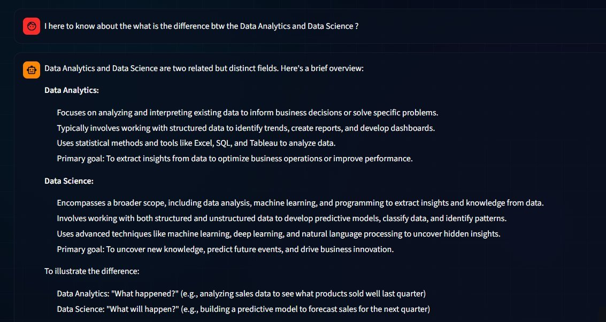
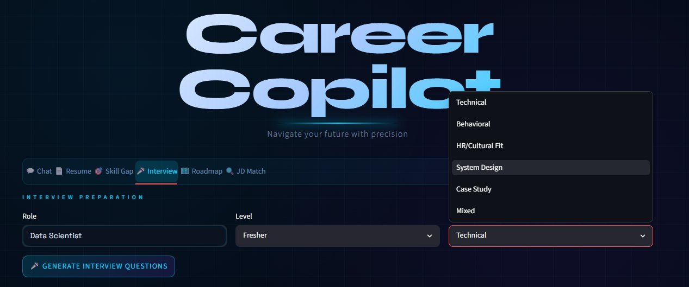
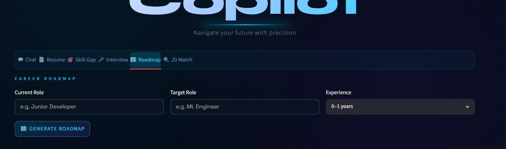

# 🚀 Career Copilot

<p align="center">
  
</p>

<p align="center">
  
  
  
  
</p>

<p align="center">
  
</p>

---

## 🤖 What is Career Copilot?

**Career Copilot** is an AI-powered career assistant built with **Streamlit** and **Google Gemini**. It helps you analyze your resume, identify skill gaps, prepare for interviews, plan your career roadmap, and match your profile to job descriptions — all in one sleek dark-themed app.

---

## ✨ Features

| Tab | Feature |
|-----|---------|
| 💬 **Chat** | AI career advisor — ask anything about roles, skills, interviews |
| 📄 **Resume** | Upload PDF → get a detailed AI analysis & download report |
| 🎯 **Skill Gap** | Compare your skills vs your target role |
| 🎤 **Interview** | Generate role-specific interview questions (Technical / HR / System Design) |
| 🗺️ **Roadmap** | Get a step-by-step career roadmap from your current to target role |
| 🔍 **JD Match** | Paste a job description → see how well your resume matches |

---

## 📸 Screenshots

### 💬 AI Career Chat
> Ask anything about careers, roles, interviews, skill gaps

<p align="center">
  
</p>

---

### 📄 Resume Analysis
> Upload your resume PDF and get a detailed strengths, weaknesses & missing skills report

<p align="center">
  
</p>

---

### 🎯 Skill Gap Analysis
> Enter your current skills, target role & experience level to see exactly what you're missing

<p align="center">
  
</p>

---

### 🎤 Interview Preparation
> Generate role-specific questions — Technical, Behavioral, HR, System Design, Case Study & Mixed

<p align="center">
  
</p>

---

### 🗺️ Career Roadmap
> Get a personalized step-by-step roadmap from your current role to your dream job

<p align="center">
  
</p>

---

### 🔍 JD Match
> Paste a job description and match it against your resume instantly

<p align="center">
  
</p>

---

## 🛠️ Tech Stack

<p align="left">
  
  
  
  
</p>

---

## 🚀 Getting Started

### 1. Clone the repo
```bash
git clone https://github.com/aravindsai2202/career-copilot.git
cd career-copilot
```

### 2. Install dependencies
```bash
pip install -r requirements.txt
```

### 3. Set up your API key

Create a `.streamlit/secrets.toml` file:
```toml
GEMINI_API_KEY = "your_gemini_api_key_here"
```

Get your free Gemini API key at 👉 [Google AI Studio](https://aistudio.google.com/app/apikey)

### 4. Run the app
```bash
streamlit run app.py
```

---

## ☁️ Deploy on Streamlit Cloud

1. Push this repo to GitHub
2. Go to [streamlit.io/cloud](https://streamlit.io/cloud) → **New App**
3. Select this repo and set `app.py` as the entry point
4. Add your secret in **App Settings → Secrets**:
```toml
GEMINI_API_KEY = "your_gemini_api_key_here"
```
5. Click **Deploy** 🎉

---

## 📁 Project Structure

```
career-copilot/
├── app.py                  # Main Streamlit app
├── requirements.txt        # Dependencies
├── config/                 # App configuration
├── prompts/                # AI prompt templates
├── screenshots/            # App screenshots
├── services/
│   └── gemini_service.py   # Gemini AI integration
└── utils/
    ├── memory.py           # Chat history management
    └── resume_parser.py    # PDF text extraction
```

---

## 🤝 Contributing

Pull requests are welcome! Feel free to open an issue for bugs or feature requests.

---

## 📬 Connect

[](https://github.com/aravindsai2202)

---

<p align="center">⭐ <i>If you find this useful, give it a star!</i> ⭐</p>